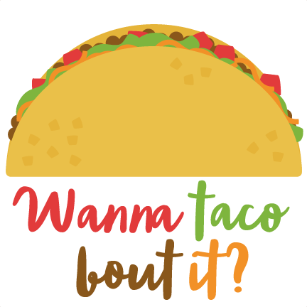

---

 

  

  <h3 align="center">Wanna Taco !?</h3>

  

App de Melp que brinda información de los restauratne con más sabor y estilo    
    <a href="https://github.com/eriika19/wanna-taco/tree/master/components"><strong>Explorar proyecto »</strong></a>
     
     
    <a href="https://wanna-taco.now.sh/">Ir a Sitio</a>
    ·
    <a href="https://github.com/eriika19/wanna-taco/issues">Reportar Problema</a>
    ·
  

   

 
 <h3 align="center"> Next. js, Redux-Saga, Bulma, Axios, Express, Jest, Babel, Eslint, Lint-staged</h3>

  

---

# Contenido

- [Acerca del Proyecto](#acerca-del-proyecto)
  - [Herramientas](#_herramientas_)
  - [Próximos alcances](#próximos-alcances)
- [Contacto](#contacto)

  

## Acerca del proyecto 🚀

Esta aplicación se desarrollo para brindar información actualizada de los mejores los
restaurantes.Se puede realizar búsqueda por tipo de comida, orden alfabètico y puntuación.

Se consumió el dataset de Melp implementando solicitudes Axios y se construyó un mapa interactivo
que muestra la ubicación exacta de todos los restaurantes, de dicho dataset, dentro del mapa
interactivo. Al dar clic en cada icono de ubicación se despliga un pop up la información más
relevante del restaurante en dicha localización

  

### _*Herramientas*_ 🛠️

- [Next.js](https://github.com/zeit/next.js/)
- [Redux-Saga](https://github.com/bmealhouse/next-redux-saga)
- [Axios](https://github.com/axios/axios)
- [Express](https://expressjs.com/)
- [Jest](https://jestjs.io/)
- [React Testting Library](https://testing-library.com/docs/react-testing-library/intro)
- [Bulma](https://bulma.io/)
- [React-reveal](https://www.react-reveal.com/)
- [Hooks](https://es.reactjs.org/docs/hooks-intro.html)
- [Git](https://git-scm.com/)
- [Eslint](https://eslint.org/)
- [Lint-staged](https://openbase.io/js/lint-staged)
- [Husky](https://github.com/typicode/husky)
- [Now de Vercel](https://vercel.com/import?utm_medium=default-template&filter=next.js&utm_source=create-next-app&utm_campaign=create-next-app-readme)
- [GitHub Emoji Cheat Sheet](https://www.webpagefx.com/tools/emoji-cheat-sheet)
- [Prettier](https://github.com/prettier/prettier)
- [Airbnb Style Guide](https://github.com/airbnb/javascript)

  

## Próximos alcances

- [ ] Alcanzar cobertura >80% en todos los componentes y páginas

- [ ] Mostrar información estadística con Google Analytics.

- [ ] Añadir botones funcionales de compartir y dar like en redes sociales.

- [ ] Terminar componente y funcionalidad para paginación del set de datos.

- [ ] Mostrar ruta al restaurante seleccionado según la localización del usuario.

- [ ] Permitir agregar comentario o reseña al restaurante seleccionado.

  

---

> ## _Contacto_

Creado con ❤️ por [Itzel Enciso](https://github.com/eriika19)

Sitio Web - [itzelenciso.com](https://itzelenciso.com/)

LinkedIn - [@itzelenciso](https://www.linkedin.com/in/itzelenciso/)

Correo Gmail -
[enciso.iq@gmail.com](<mailto:enciso.iq@gmail.com?subject=Reclutamiento&body=¡Buen día! el motivo de contacto es:>)

¡Gracias por visitar! 😊
